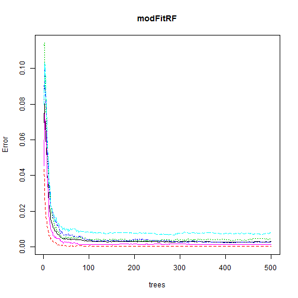
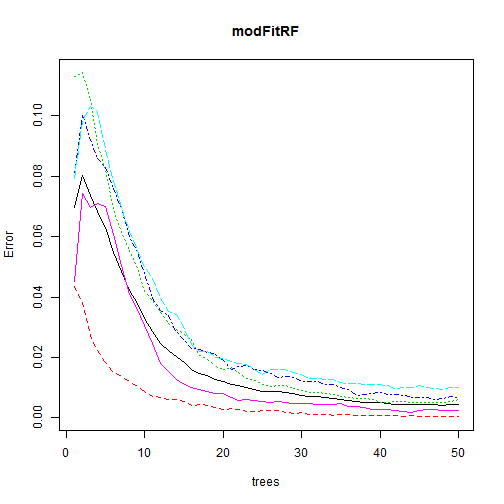

## Practical Machine Learning Course Project
## Predicting the Quality of Activity
### Summary
For this course project, we were working with a large dataset created by Groupware@LES. Six participants were asked to perform one set of 10 repetitions of the Unilateral Dumbbell Biceps Curl in five different fashions:

- A - exactly correctly
- B - throwing the elbows to the front
- C - lifting the dumbbell only halfway
- D - lowering the dumbbell only halfway 
- E - throwing the hips to the front

Their activity was measured with sensors at the belt, upper arm and forearm.

Using this data, we were to develop an algorithm do identify the classification of activity quality based on the sensor outputs.

In the end, I found that using a Random Forest algorithm was incredibly accurate and, with some very minor tuning, highly efficient.

### Exploring and Cleaning the Data
I first opened the .csv file and looked at the data. There were 19622 samples of 160 variables provided in the training set. On first glance, it was immediately obvious that many of these variables were missing for most of the samples, and so I started reducing the dimensions of this problem.

Firstly, I removed the name and time variables. Making predictions based on these might be an effective way to predict within this dataset, but would be entirely useless if a test dataset contained other subjects or had the excersized done in a different order. I also removed all the other variables that didn't correspond to sensor outputs.

Second, I removed all the variables that contained very little data. Variables like kurtosis and skewness, as well as the maximums and minimums were removed because they could be inferred from the 3D accelerometer and gyroscope data.

This left me with 53 entirely functional variables to use as predictors, which was much more manageable.


```
## Loading required package: lattice
## Loading required package: ggplot2
## randomForest 4.6-10
## Type rfNews() to see new features/changes/bug fixes.
```


### Creating the Model
To create the prediction, I chose to use the Random Forest modeling method. This algorithm is typically very accurate and seemed appropriateb because this is a discrete classification problem, which is one where this algorithm excels.

To construct my model, I used the randomForest() function, which I found much simpler to use than the caret train(method="rf") function. I set up a timer to see how long the function would run, set the seed and ran the function on all of my variables.


```r
ptm <- proc.time()

set.seed(321)
modFitRF = randomForest(classe ~ ., data = training)

modelingtime = proc.time() - ptm
```


The untuned Random Forest model used 500 trees, took about 66 seconds to run and created a model with the following specifications:


```
## 
## Call:
##  randomForest(formula = classe ~ ., data = training) 
##                Type of random forest: classification
##                      Number of trees: 500
## No. of variables tried at each split: 7
## 
##         OOB estimate of  error rate: 0.29%
## Confusion matrix:
##      A    B    C    D    E class.error
## A 5579    1    0    0    0   0.0001792
## B   11 3780    6    0    0   0.0044772
## C    0    8 3413    1    0   0.0026300
## D    0    0   23 3191    2   0.0077736
## E    0    0    2    2 3603   0.0011090
```


The plot of the error vs number of trees for this model was as follows:
 


From this plot, we can see that the error stabilizes well before the 500th tree, so we can significatly reduce the number of trees used. In fact, it looks like there is very little benefit in using over 50 trees. Limiting the number of trees to 50 and remodeling yields the following:


```r
set.seed(321)
modFitRF = randomForest(classe ~ ., data = training, ntree = 50)
modFitRF
```

```
## 
## Call:
##  randomForest(formula = classe ~ ., data = training, ntree = 50) 
##                Type of random forest: classification
##                      Number of trees: 50
## No. of variables tried at each split: 7
## 
##         OOB estimate of  error rate: 0.45%
## Confusion matrix:
##      A    B    C    D    E class.error
## A 5578    2    0    0    0   0.0003584
## B   13 3774    9    0    1   0.0060574
## C    0   14 3399    8    1   0.0067212
## D    0    0   31 3184    1   0.0099502
## E    0    0    4    5 3598   0.0024951
```


This model yields a slightly higher OOB error estimate (0.44% vs 0.29%), but it's still extremely accurate and takes about 7 seconds to run, which is a massive performance boost.

The trees vs error curve shows that we could probably reduce the number of trees a little more without much of an accuracy decrease, but with the current runtime, there is little reason to compromise for the purpose of this project.

 


The predictions for the test data, which are all accurate, are as follows:

```r
predictionRF = predict(modFitRF, testing)
predictionRF
```

```
##  1  2  3  4  5  6  7  8  9 10 11 12 13 14 15 16 17 18 19 20 
##  B  A  B  A  A  E  D  B  A  A  B  C  B  A  E  E  A  B  B  B 
## Levels: A B C D E
```


### Cross Validation

The Random Forest function includes a cross validation algorithm during the tree selection process, so it provide an OOB (out of box) error estimate for out of sample error. For the purpose of this project, I conducted a cross validation to learn.

I chose random sampling to select my cross validation test set. I did so because I did not want to capture any trends that selecting consecutive samples might lead to, based on the fact that many adjascent samples will have been from the same subject and may have a temporal relationship. I set the test set to 10% of the data and looped through the prediction 20 times.


```
## [1] "Error for pass 1 : 0.00203873598369009"
## [1] "Error for pass 2 : 0.00203873598369009"
## [1] "Error for pass 3 : 0.00356778797145774"
## [1] "Error for pass 4 : 0.00407747196738018"
## [1] "Error for pass 5 : 0.00611620795107037"
## [1] "Error for pass 6 : 0.00356778797145774"
## [1] "Error for pass 7 : 0.00305810397553519"
## [1] "Error for pass 8 : 0.00458715596330272"
## [1] "Error for pass 9 : 0.00356778797145774"
## [1] "Error for pass 10 : 0.00458715596330272"
## [1] "Error for pass 11 : 0.00611620795107037"
## [1] "Error for pass 12 : 0.00662589194699281"
## [1] "Error for pass 13 : 0.00407747196738018"
## [1] "Error for pass 14 : 0.00254841997961264"
## [1] "Error for pass 15 : 0.00407747196738018"
## [1] "Error for pass 16 : 0.00611620795107037"
## [1] "Error for pass 17 : 0.00407747196738018"
## [1] "Error for pass 18 : 0.00458715596330272"
## [1] "Error for pass 19 : 0.00203873598369009"
## [1] "Error for pass 20 : 0.00254841997961264"
```

```
## [1] "Average error : 0.00400101936799184"
```

As we can see, the error estimated by the randomForest() function was not optimistic, and actually quite close to the random cross vaidation that I performed manually.

### Other Thoughts
One possible performance improvement could be gained from further reducing the dimensionality of the problem. I believe that this dataset lends itself well to this.

When we construct a correlation marix of all of the variables, we can see that quite a few of them have a correlation of over 0.9.


```
##       [,1]               [,2]              
##  [1,] "roll_belt"        "total_accel_belt"
##  [2,] "roll_belt"        "accel_belt_y"    
##  [3,] "roll_belt"        "accel_belt_z"    
##  [4,] "pitch_belt"       "accel_belt_x"    
##  [5,] "total_accel_belt" "roll_belt"       
##  [6,] "total_accel_belt" "accel_belt_y"    
##  [7,] "total_accel_belt" "accel_belt_z"    
##  [8,] "accel_belt_x"     "pitch_belt"      
##  [9,] "accel_belt_y"     "roll_belt"       
## [10,] "accel_belt_y"     "total_accel_belt"
## [11,] "accel_belt_y"     "accel_belt_z"    
## [12,] "accel_belt_z"     "roll_belt"       
## [13,] "accel_belt_z"     "total_accel_belt"
## [14,] "accel_belt_z"     "accel_belt_y"    
## [15,] "gyros_arm_x"      "gyros_arm_y"     
## [16,] "gyros_arm_y"      "gyros_arm_x"     
## [17,] "gyros_dumbbell_x" "gyros_dumbbell_z"
## [18,] "gyros_dumbbell_x" "gyros_forearm_z" 
## [19,] "gyros_dumbbell_z" "gyros_dumbbell_x"
## [20,] "gyros_dumbbell_z" "gyros_forearm_z" 
## [21,] "gyros_forearm_z"  "gyros_dumbbell_x"
## [22,] "gyros_forearm_z"  "gyros_dumbbell_z"
```


From this, we can see that roll_belt is heavily correlated to 3 other variables, therefore, it wouldn't be unreasonable to expect good results from a PCA of these 4 variables, reducing the problem by 3 dimensions while losing very little accuracy. This approach was not necessary for this problem, however, because it's very manageable with a basic cleaning of the dataset and tuning of the modeling algorithm.

THE END
